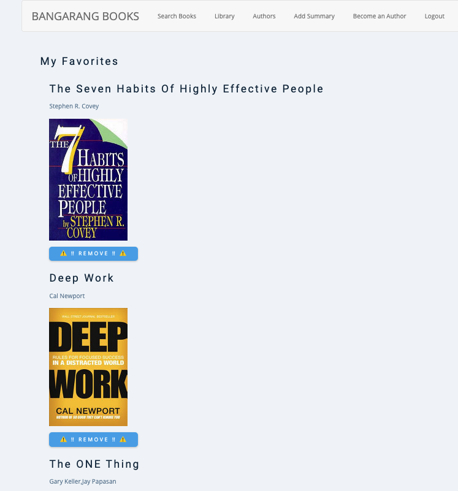

# BANGARANG BOOKS


## User Story

The user wants a digital library with all their favorite books. They want to easily search for books they already own or plan to own and add them to a list they can easily reference. The user wants to create summaries for the books they read, so they can easily refer back to the main ideas. 

## Criteria
Key features for user:
- Easily navigate through the site
- Search for books
- View books cover image, title, and authors
- Have a secure session unique to each user
- Easily create an account/login
- Create summaries for books
- Add and delete books from library 
- Edit book summaries
- Post book summaries for other users to see
- Make comments on book summaries

## Approach
1. Separated tasks by Express
2. Initialized repo
3. Created migration file and test seed files for database
4. Created app.js file and imported node modules
5. Created controllers
6. Created routes
7. user authentication
8. Created models
9. Connected to local host
10. Created index, registration, header, footer, user dash, book, individual book, search, search results
11. Create search component and connect to Google Books API
13. Wrote up directions for API
14. Added private routes for user auth
15. Added CRUD functionality to front-end
16. Styled app
17. Launched to Heroku

## Installation Instructions
1. Run `npm install` 
2. In the root folder, create `.env` file and add `SECRET_KEY`. Set the secret key to anything you want.
3. Run `create db:[db_name]` from the terminal in the root folder. This will create the database.
4. Run `migrations` using `psql`
5. install `express`
5. Run using `npm start` 

## Wire Frame


## Coding Wins

```javaScript
// ========================================================
//                   DELETE
// ========================================================

// DELETE / Removes book from faves model 
app.delete("/remove/:id", (req, res) => {
  db.fave.destroy({
    where: {id: req.params.id },
  });
  res.redirect("/profile");
});

// DELETE / Removes article from articles model
app.delete('/articles/:id', (req, res) => {
  db.article.destroy({
    where: {id: req.params.id },
  });
  res.redirect("/");
});
```
## Coding Losses
```js
// ========================================================
//                   PUT
// ========================================================
router.put('/edit/:id', (req, res) => {
  db.article.update({
    title: req.body.title,
    content: req.body.content,
  },{ where: {id: req.params.id} })
  .then( updatedArticle => {
    console.log(`-----successfully updated article-----`)
    res.redirect('/')
  })
})
```
## Images

## Favorites

## Search Results


